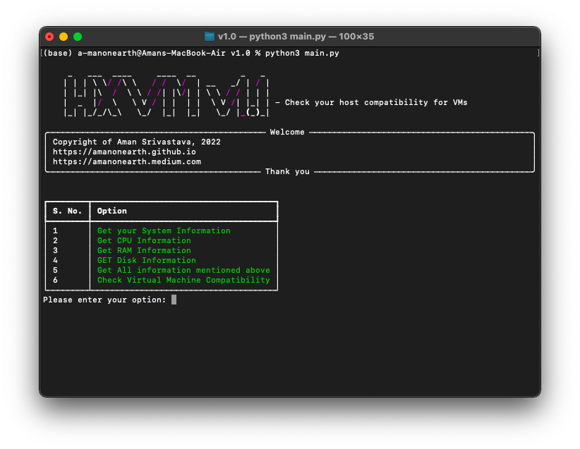
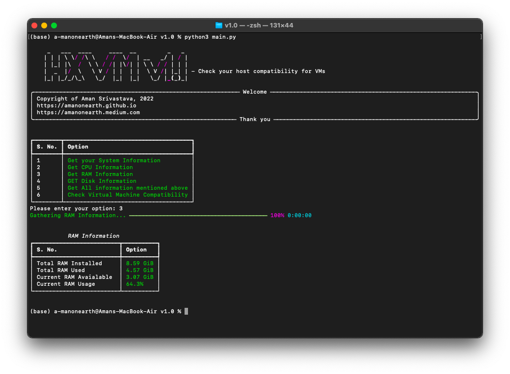
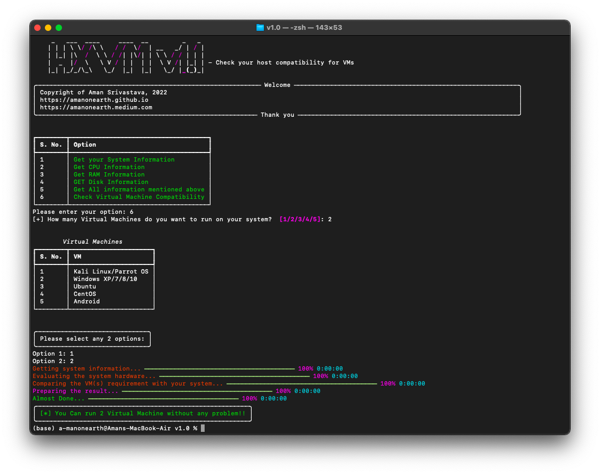
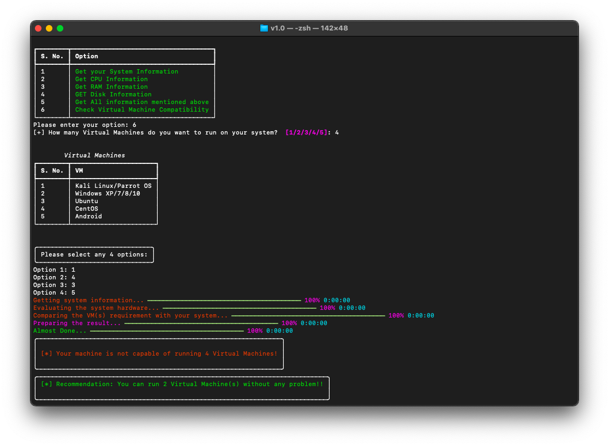

<h1 align="center">HXVM - Check Host compatibility with the Virtual Machines.</h1>

  <a href="#features">Features</a> |
  <a href="#installation">Installation</a> |
  <a href="#usage">Usage</a> 

# Features
</a>
- Takes input from user to compare how many VMs they can run on their system
- User can also get all system information
- Recommends the number of VMs that can be run smoothly
- Fast and User Friendly

# Installation
- First clone the repository or download the zip file:  
<code> git clone https://github.com/amanonearth/HXVM.git </code>
- Navigate to the directory and install all the requirements:  
<code> pip install -r REQUIREMENTS.txt </code>
- Give python files executable permission by running the code: 
<code> sudo chmod +x *.py </code>

# Usage
- To run the program, run main file: 
** <code> python3 main.py </code>  
- Choose from the available options  <h4 align="center">Example: Option 3- RAM Information</h4>
</a>
- If you want to check that how many virtual machine you can run:

<b>choose option 6</b> >> then enter the <b>no. of VM(s)</b> you want to run >> then <b>select the VM(s)</b> 

</a>
- If your system can not handle the number of virtual machine you entered, it will recommend the best possible option
</a>

# Article
coming soon...
